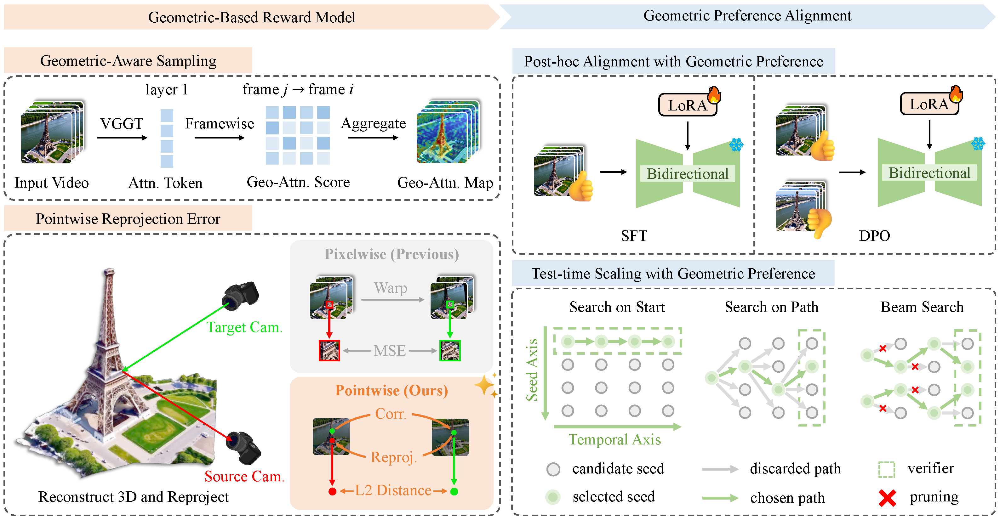

# VIGOR: VIdeo Geometry-Oriented Reward for Temporal Generative Alignment

## News

## Overview

## Installation

## Test-Time Scaling

## Post-hoc Alignment

## Citation

If you use this code in your research, please cite:

## License

This project is licensed under the MIT License.

## Acknowledgment
